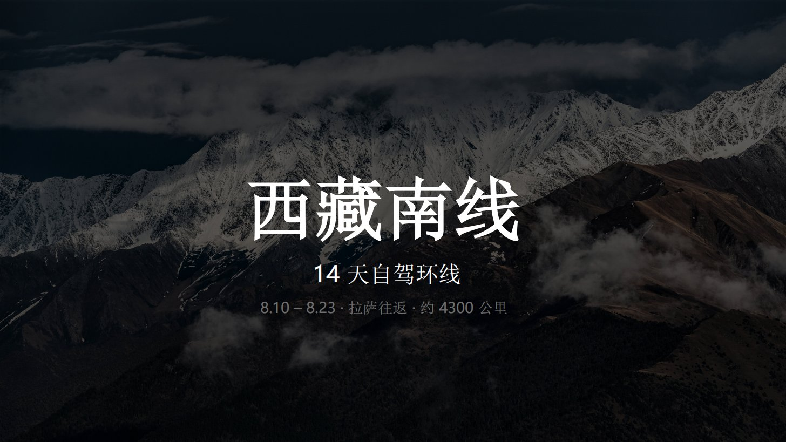
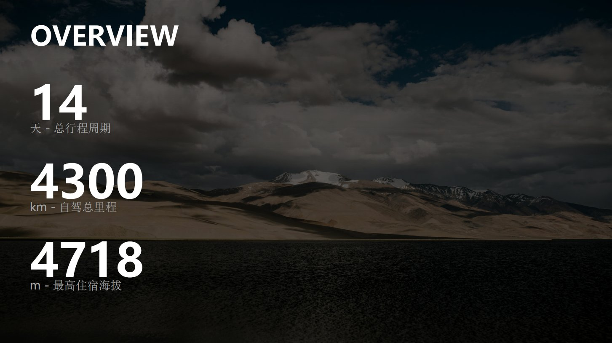
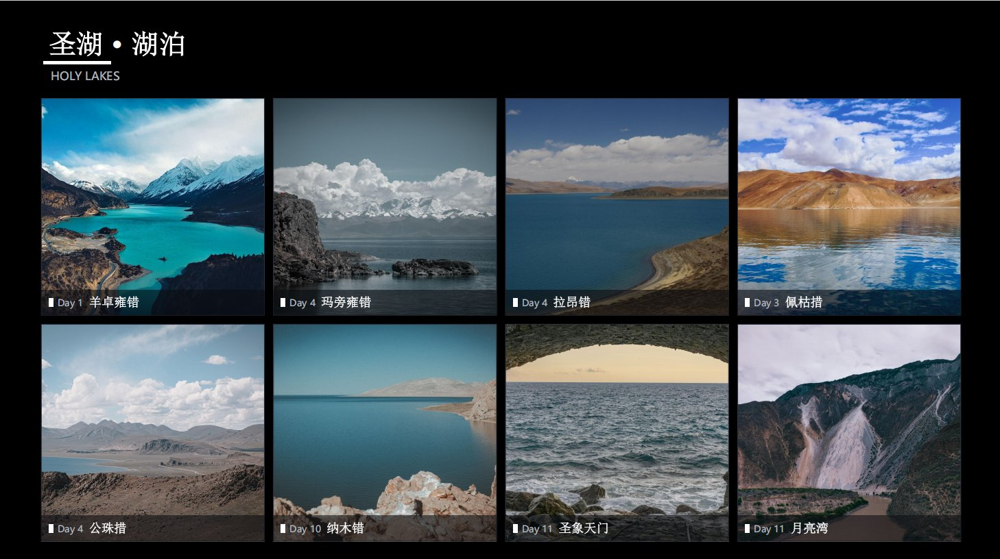
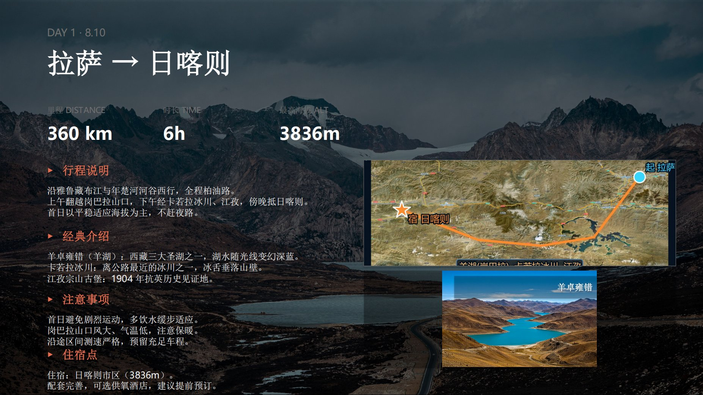
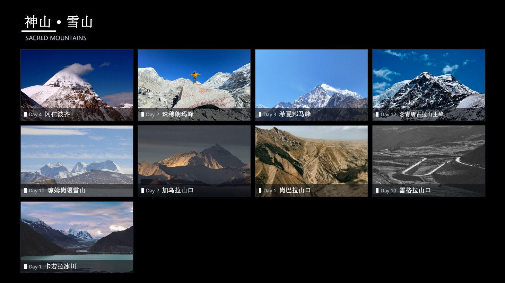
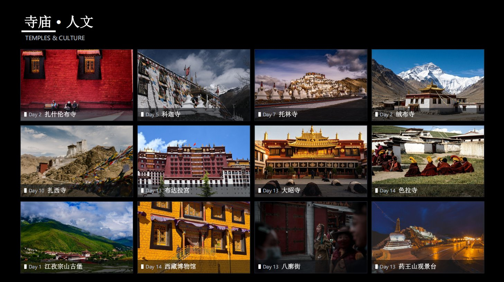
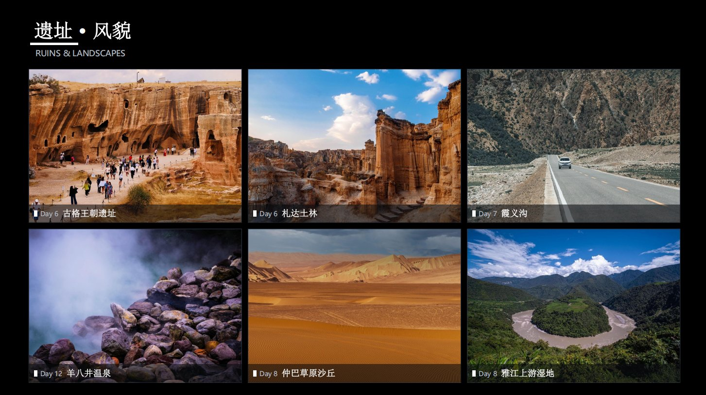

> 把结构化行程数据渲染成 **16:9 可编辑 PPTX** 的 WorkBuddy skill。
> Render a **structured itinerary** into an editable 16:9 PPTX — a WorkBuddy skill.

一个统一技能，内置三类行程场景 / One unified skill with three built-in trip scenarios:

- **城市多日游 (City Multi-day Tour)**：Pexels 精准实拍作背景，单栏排版。
- **自驾 / 户外环线 (Roadtrip / Outdoor Loop)**：全幅背景 + 右上**真实路线地图**（高德卫星瓦片）+ 右下**当天景点图（原比例）** + 左列四块文字。
- **景点图鉴 (Spot Gallery)**：按主题分组的紧凑网格陈列，每格一张实拍 + 景点名 + 到达日标签。

---

## 目录 / Table of Contents

- [中文说明](#中文说明)
  - [功能特性](#功能特性)
  - [仓库结构](#仓库结构)
  - [快速开始 · 自驾 / 户外环线](#快速开始--自驾--户外环线)
  - [快速开始 · 城市多日游](#快速开始--城市多日游)
  - [快速开始 · 景点图鉴](#快速开始--景点图鉴)
  - [排版规范](#排版规范)
  - [依赖](#依赖)
  - [案例展示 / Showcase](#案例展示--showcase)
  - [案例 / Examples](#案例--examples)
- [English](#english)
  - [Features](#features)
  - [Repository structure](#repository-structure)
  - [Quick start · Roadtrip / Outdoor Loop](#quick-start--roadtrip--outdoor-loop)
  - [Quick start · City Multi-day Tour](#quick-start--city-multi-day-tour)
  - [Quick start · Spot Gallery](#quick-start--spot-gallery)
  - [Layout spec](#layout-spec)
  - [Dependencies](#dependencies)
  - [Showcase](#showcase)
  - [Examples](#examples)
- [许可证 / License](#许可证--license)

---

## 中文说明

### 功能特性

- **三类行程场景**：城市游（无 GPS 路线）、自驾/环线（有逐日 GPS 路线）、景点图鉴（按主题网格陈列全部景点）统一在一个 skill 内，按行程类型自动选用，无需在多个子工具间切换。
- **景点图鉴**：把一趟行程的所有景点按主题分组做成紧凑网格陈列，每格一张实拍 + 景点名 + 到达日标签；抓图阶段**全局去重 + 感知哈希二次核查**，保证整套图鉴无重复图。
- **真实地图**：自驾/户外环线用高德卫星瓦片（国内直连、免 API key）生成真实路线地图，自动做 WGS-84 → GCJ-02 坐标转换，紧贴当天路线缩放并标绘轨迹。
- **原比例景点图**：景点图以 `contain` 原比例居中嵌入，**绝不拉伸压扁**。
- **可编辑输出**：python-pptx 生成，所有文字/图片后续可在 PowerPoint 直接改。
- **自动防锁**：PPTX 被打开导致写入失败时，脚本自动换名输出，不阻塞流程。

### 信息不足时主动询问

本 skill 强依赖结构化数据。若你只说「做个旅行PPT」却没给足材料，agent 会**先问再动手**，不会凭空捏造（尤其 GPS 坐标、真实地名、里程、住宿点、文案）。常见澄清项：

- **行程类型**：自驾/环线（有逐日 GPS 路线）走自驾/户外环线场景；城市观光走城市多日游场景；只要景点清单走景点图鉴场景。
- **自驾 / 户外环线缺料**：逐日路线（起点→途经→终点）、每日文案（行程说明/经典介绍/注意事项/住宿点）、图片策略（默认优先 Pexels 实拍；无合适图再用 AI 生成 / 你自备）。
- **城市多日游缺料**：行程标题、城市与天数、酒店、预算、背景图关键词。
- **景点图鉴缺料**：景点清单（按主题分组）+ 每个景点的 Pexels 英文搜索词；到达日（可选，用于 Day N 标签）。
- **输出偏好**：文件名、是否要预算页/住宿页、语言（中文 / 中英双语）。

原则：缺数据先问、缺图先定策略、绝不编造坐标与事实。

### 仓库结构

```
travel-ppt-skill/
├── SKILL.md                       # 中英双语 skill 说明（含触发词、数据 schema、排版规范）
├── README.md                      # 本文档
├── scripts/
│   ├── gen_pptx.py                # 城市多日游 PPTX 生成器
│   ├── fetch_trip.py              # 城市多日游：按关键词从 Pexels 拉取精准实拍
│   ├── make_routes.py             # 城市多日游：路线辅助
│   ├── gen_maps.py                # 自驾/户外环线：真实路线地图生成器（高德瓦片）
│   ├── gen_pptx_roadtrip.py       # 自驾/户外环线：每日双框排版 PPTX 生成器
│   ├── fetch_spot_photos.py       # 景点图鉴：从 Pexels 抓景点图（全局去重 + 感知哈希二次核查）
│   └── gen_spot_gallery.py        # 景点图鉴：景点图鉴网格排版 PPTX 生成器
├── templates/
│   ├── trip_data_template.py      # 城市多日游数据模板
│   ├── roadtrip_data_template.py  # 自驾/户外环线数据模板（含阿里南线 14 天全量示例）
│   └── spot_gallery_template.py   # 景点图鉴数据模板（含西藏南线 35 景点示例）
├── references/
│   ├── roadtrip_layout.md         # 自驾/户外环线权威排版规格（坐标 / 配色 / 字体）
│   └── spot_gallery_layout.md     # 景点图鉴权威排版规格（网格 / 配色 / 字体）
├── examples/
│   ├── 西藏自驾环线-Tibet-self driving.pdf   # 案例：用本 skill 生成的阿里南线 14 天自驾环线 PPT（双语）
│   └── 西藏景点图鉴.pptx                       # 案例：用本 skill 生成的西藏南线景点图鉴（4 页网格 + 到达日）
└── assets/
    └── examples/                    # 案例实拍截图（README 展示用）
        ├── tibet-cover.jpg
        ├── tibet-overview.jpg
        ├── tibet-spot-mountains.jpg
        ├── tibet-spot-lakes.jpg
        ├── tibet-spot-temples.jpg
        ├── tibet-spot-ruins.jpg
        └── tibet-day1.jpg
```

### 配置 Pexels API Key（首次使用前）

城市多日游与景点图鉴默认用 **Pexels 高清实拍**；自驾/户外环线的当天景点图也优先 Pexels。首次使用前需配置一个免费 Pexels API Key（约 1 分钟）：

1. 打开 https://www.pexels.com/api/ ，登录后点击「Get Started」免费申请 Key。
2. 二选一配置：
   - **环境变量（推荐）**：`PEXELS_API_KEY=你的key`，脚本自动读取。
   - **密钥文件**：把 key 写进 `scripts/pexels_key.txt`（一行，可加 `#` 注释）。
3. 验证：`python scripts/fetch_trip.py --map '{"beijing":["Forbidden City Beijing"]}'` 能抓到图即成功。

图片策略：**优先 Pexels 真实摄影**（画面真实、版权可溯源，脚本生成 CREDITS.txt 署名）；仅当某目的地在 Pexels 搜不到贴合图时，才回退 ImageGen 生成。注意：Pexels 要求署名，请保留 CREDITS.txt；Key 属私密，勿提交进公开仓库。

### 快速开始 · 自驾 / 户外环线

1. **准备数据**：在你的旅行目录（如 `alida-deck/`）放一份 `trip_data.py`，定义 `NODE`（地点经纬度，WGS-84）、`DAYS`（逐日路线）、`get_img / get_spot / get_map`（图片路径函数）与页面序列 `S`。可直接复制 `templates/roadtrip_data_template.py` 改。
2. **生成地图**：
   ```bash
   cd /path/to/your/trip
   python <skill>/scripts/gen_maps.py        # 输出 maps/day_map_{day}.png（需联网）
   ```
3. **生成 PPTX**：
   ```bash
   python <skill>/scripts/gen_pptx_roadtrip.py  # 输出 <TRIP_TITLE>-roadtrip.pptx
   ```
4. **改行程**：只改 `trip_data.py` 对应 day dict，重跑即可，无需动布局代码。

> 景点图：优先精准实拍（Pexels / 自备）；小众地标可用 ImageGen 工具按地标提示词生成写实图（1536×1024），放入 `spot_photos/spot_{day}.png`。

### 快速开始 · 城市多日游

```bash
python <skill>/scripts/gen_pptx.py <数据模块.py> <输出.pptx> \
    [--photos ppt_assets/photos] [--budget 预算.xlsx] [--cover-slug cover]
```

背景图由 `fetch_trip.py` 按精准英文关键词从 Pexels 拉取，Pexels 无图时回退 ImageGen 生成；统一裁到 1920×1080 并轻度压暗/提饱和，**保持非黑白**。

### 快速开始 · 景点图鉴

适合做「行程看点清单 / 景点手册」附册：把全部景点按主题网格陈列，每格一张实拍 + 景点名 + 到达日。

1. **准备数据**：复制 `templates/spot_gallery_template.py` 到旅行目录，按真实景点填 `GROUPS`（分组）、`SPOT_QUERIES`（每个景点的 Pexels 英文搜索词 + 期望关键词）、`DAYS`（可选，到达日）。西藏南线 35 景点示例已内置，可直接改。
   - 排序：`SORT='theme'`（默认，按主题分组）或 `SORT='day'`（按 `DAYS` 升序全局时间线，从 Day 1 起连续铺开）。
2. **抓图（去重 + 二次核查）**：
   ```bash
   cd /path/to/your/trip
   python <skill>/scripts/fetch_spot_photos.py --data spot_gallery_data.py   # 输出 spot_gallery/*.jpg + CREDITS.txt
   ```
   脚本自动全局去重（无重复图）并做感知哈希二次核查；Pexels 搜不到的小众地标写入 `spot_gallery/_fallback.txt`。
3. **（可选）AI 兜底**：对 `_fallback.txt` 里的地标，用 ImageGen 工具按地标提示词生成写实图，放入同名 `spot_gallery/{景点名}.jpg`。
4. **生成 PPTX**：
   ```bash
   python <skill>/scripts/gen_spot_gallery.py --data spot_gallery_data.py --out 景点图鉴.pptx
   ```
5. **改景点**：只改数据模块，重跑即可，无需动布局代码。

> 版式：深色背景 + 白强调（橘色图标已改白）+ 微软雅黑；杂志式紧凑网格（间距 0.12in），图片 cover 裁切填满；每格底部半透明黑条 + 白色小方块 + 白字名称 + `Day N` 标签。详见 `references/spot_gallery_layout.md`。

### 排版规范

权威坐标见 `references/roadtrip_layout.md`（自驾/户外环线）与 `references/spot_gallery_layout.md`（景点图鉴）。要点：

- 画布 13.33 × 7.5 in；左列 x=0.8 宽 5.8；右列 x=6.9 宽 5.9。
- 右上双框（自驾/户外环线）：上框地图 `(6.9, 3.05, 5.9, 2.0)`；下框景点图 `(6.9, 5.15, 5.9, 2.0)` **contain 原比例**。
- 背景用 **cover 铺满**（按原比例缩放 + 居中裁切），绝不固定尺寸拉伸。
- 配色（自驾/户外环线）：黑底、白字、橘色强调 `(232,109,78)`；字体微软雅黑。
- 配色（景点图鉴）：深色背景 `(11,14,20)` + **白强调**（橘色图标已改白）+ 微软雅黑；杂志式紧凑网格（gutter 0.12in），图片 cover 裁切填满；每格底部半透明黑条 + 白色小方块 + 白字名称 + `Day N` 标签。

生成后建议用 `SKILL.md` 末尾的校验脚本扫描越界 shape，并确认景点图比例未被拉伸。

### 依赖

- 自驾 / 户外环线：`python-pptx`、`Pillow`、`numpy`、`matplotlib`（生成地图需联网）。
- 城市多日游：`python-pptx`、`Pillow`、`openpyxl`、`requests`（Pexels）。
- 景点图鉴：`python-pptx`、`Pillow`、`requests`（Pexels 抓图 + 感知哈希去重）；小众地标兜底用 ImageGen 工具。
- 安装：`python -m pip install python-pptx Pillow numpy matplotlib openpyxl requests`

### 案例 / Examples

- `examples/西藏自驾环线-Tibet-self driving.pdf` — 用本 skill（自驾/户外环线场景）生成的**阿里南线 14 天自驾环线**行程册样例：全幅背景 + 右上真实路线地图 + 右下当天景点图（原比例）+ 左列四块文字。可直接打开参考版式与排版。
- `examples/西藏景点图鉴.pptx` — 用本 skill（景点图鉴场景）生成的**西藏南线景点图鉴**样例：按到达日（`SORT='day'`）全局时间线排序，3 页紧凑网格、每格实拍 + 景点名 + 到达日标签，可打开参考版式。

### 案例展示 / Showcase

> 下方为西藏南线 14 天自驾环线 + 景点图鉴的实机页面截图。

| 封面 / Cover | 行程概览 / Overview |
|--------------|---------------------|
|  |  |

| 神山 · 雪山 / Sacred Mountains | 圣湖 · 湖泊 / Holy Lakes |
|------------------------------|-------------------------|
| ![景点图鉴]
 |  |

| 寺庙 · 人文 / Temples & Culture | 遗址 · 风貌 / Ruins & Landscapes |
|---------------------------------|-----------------------------------|
| ![景点图鉴]
| ![景点图鉴]
 |

| Day 1 · 拉萨 → 日喀则 / Lhasa → Shigatse |
|------------------------------------------|
|  |

---

## English

### Features

- **Three trip scenarios**: City tour (no GPS route), Roadtrip / outdoor loop (day-by-day GPS route), and Spot Gallery (themed grid of all spots) — all in one skill, auto-selected by trip type, no "mode" to switch.
- **Spot Gallery**: all trip spots laid out as a compact themed grid, each cell = one real photo + name + arrival-day tag. Fetch stage does **global dedup + perceptual-hash second pass**, guaranteeing no duplicate image across the gallery.
- **Real maps**: Roadtrip / outdoor loop renders real route maps from AMap satellite tiles (direct in CN, no API key), auto-converts WGS-84 → GCJ-02, zooms tightly to the day's route and overlays the trajectory.
- **Native-ratio spot photos**: Spot images are embedded with `contain` at native aspect ratio — **never stretched**.
- **Editable output**: Built with python-pptx; all text/images remain editable in PowerPoint.
- **Lock-safe**: If the PPTX is open (write lock), the script auto-renames the output instead of blocking.

### Ask when info is missing

This skill depends heavily on structured data. If you only say "make a travel PPT" without enough material, the agent will **ask first, then build** — it will not fabricate (especially GPS coords, real place names, distances, stays, copy). Typical clarifications:

- **Trip type**: self-drive/loop (day-by-day GPS route) → Roadtrip scenario; city tour → City tour scenario; spot list only → Spot Gallery scenario.
- **Roadtrip gaps**: per-day route (start → via → end), per-day copy (trip notes / highlights / cautions / stays), image strategy (prefer Pexels real shots by default; use AI-generated / your own only when no good match).
- **City tour gaps**: trip title, cities & days, hotels, budget, background keyword.
- **Spot Gallery gaps**: spot list (grouped by theme) + per-spot Pexels English query; arrival day (optional, for Day N tag).
- **Output prefs**: file name, whether to include budget/stay pages, language (zh / bilingual).

Rule of thumb: ask before building when data is missing, decide image strategy before generating, never invent coordinates or facts.

### Repository structure

```
travel-ppt-skill/
├── SKILL.md                       # Bilingual skill doc (triggers, data schema, layout spec)
├── README.md                      # This document
├── scripts/
│   ├── gen_pptx.py                # City tour PPTX generator
│   ├── fetch_trip.py              # City tour: pull precise photos from Pexels by keyword
│   ├── make_routes.py             # City tour: route helper
│   ├── gen_maps.py                # Roadtrip / outdoor loop: real route map generator (AMap tiles)
│   ├── gen_pptx_roadtrip.py       # Roadtrip / outdoor loop: daily dual-frame PPTX generator
│   ├── fetch_spot_photos.py       # Spot Gallery: pull spot photos from Pexels (global dedup + perceptual-hash 2nd pass)
│   └── gen_spot_gallery.py        # Spot Gallery: spot-gallery grid PPTX generator
├── templates/
│   ├── trip_data_template.py      # City tour data template
│   ├── roadtrip_data_template.py  # Roadtrip / outdoor loop data template (full Ali-Nan 14-day sample)
│   └── spot_gallery_template.py   # Spot Gallery data template (full Tibet-South 35-spot sample)
├── references/
│   ├── roadtrip_layout.md         # Roadtrip / outdoor loop authoritative layout spec (coords / palette / fonts)
│   └── spot_gallery_layout.md     # Spot Gallery authoritative layout spec (grid / palette / fonts)
├── examples/
│   ├── 西藏自驾环线-Tibet-self driving.pdf   # Sample: Ali-Nan 14-day roadtrip PPT built with this skill (bilingual)
│   └── 西藏景点图鉴.pptx                       # Sample: Tibet-South spot gallery built with this skill (4 grid slides + arrival days)
└── assets/
    └── examples/                    # Showcase screenshots used in README
        ├── tibet-cover.jpg
        ├── tibet-overview.jpg
        ├── tibet-spot-mountains.jpg
        ├── tibet-spot-lakes.jpg
        ├── tibet-spot-temples.jpg
        ├── tibet-spot-ruins.jpg
        └── tibet-day1.jpg
```

### Configure Pexels API Key (before first use)

City tour and Spot Gallery use **Pexels high-res photos** by default; Roadtrip spot photos also prefer Pexels. Configure a free Pexels API Key before first use (~1 min):

1. Go to https://www.pexels.com/api/ , sign in and click "Get Started" to get a free key.
2. Either way works:
   - **Env var (recommended)**: `PEXELS_API_KEY=your_key` — the script reads it automatically.
   - **Key file**: put the key in `scripts/pexels_key.txt` (one line; `#` for comments).
3. Verify: `python scripts/fetch_trip.py --map '{"beijing":["Forbidden City Beijing"]}'` fetches an image → OK.

Image strategy: **prefer Pexels real photography** (authentic, attributable — the script writes CREDITS.txt); fall back to ImageGen only when a destination has no fitting Pexels shot. Note: Pexels requires attribution — keep CREDITS.txt; keep the key private, never commit it into a public repo.

### Quick start · Roadtrip / Outdoor Loop

1. **Prepare data**: In your trip folder (e.g. `alida-deck/`), add a `trip_data.py` defining `NODE` (place lon/lat, WGS-84), `DAYS` (per-day route), `get_img / get_spot / get_map` (image path helpers) and the slide sequence `S`. Copy `templates/roadtrip_data_template.py` as a starting point.
2. **Generate maps**:
   ```bash
   cd /path/to/your/trip
   python <skill>/scripts/gen_maps.py        # writes maps/day_map_{day}.png (needs network)
   ```
3. **Generate PPTX**:
   ```bash
   python <skill>/scripts/gen_pptx_roadtrip.py  # writes <TRIP_TITLE>-roadtrip.pptx
   ```
4. **Edit itinerary**: Change only the relevant day dict in `trip_data.py` and re-run — no layout code changes needed.

> Spot photos: prefer precise shots (Pexels / your own); for obscure landmarks use the ImageGen tool with a landmark-specific prompt (1536×1024) into `spot_photos/spot_{day}.png`.

### Quick start · City Multi-day Tour

```bash
python <skill>/scripts/gen_pptx.py <data_module.py> <output.pptx> \
    [--photos ppt_assets/photos] [--budget budget.xlsx] [--cover-slug cover]
```

Background photos are fetched from Pexels by precise English keywords via `fetch_trip.py`; falls back to ImageGen when Pexels has none. All images are cropped to 1920×1080 with light dimming/saturation — **kept in color, not B/W**.

### Quick start · Spot Gallery

Good as a "trip highlights / spot list" add-on: all spots in a themed grid, each cell = one real photo + name + arrival day.

1. **Prepare data**: Copy `templates/spot_gallery_template.py` into your trip folder and fill `GROUPS` (groups), `SPOT_QUERIES` (per-spot Pexels English query + expected keywords), and `DAYS` (optional, arrival day). A full 35-spot Tibet-South sample is built in — edit it directly.
   - Sort order: `SORT='theme'` (default, grouped by theme) or `SORT='day'` (sorted globally by `DAYS` ascending, a continuous timeline from Day 1).
2. **Fetch photos (dedup + 2nd pass)**:
   ```bash
   cd /path/to/your/trip
   python <skill>/scripts/fetch_spot_photos.py --data spot_gallery_data.py   # writes spot_gallery/*.jpg + CREDITS.txt
   ```
   The script auto-dedups (no duplicate images) and runs a perceptual-hash second pass; spots Pexels can't match are written to `spot_gallery/_fallback.txt`.
3. **(Optional) AI fallback**: For landmarks in `_fallback.txt`, use the ImageGen tool with a landmark prompt and save to the matching `spot_gallery/{spot}.jpg`.
4. **Generate PPTX**:
   ```bash
   python <skill>/scripts/gen_spot_gallery.py --data spot_gallery_data.py --out 景点图鉴.pptx
   ```
5. **Edit spots**: Change only the data module and re-run — no layout code changes.

> Layout: dark background + white accent (orange icons changed to white) + Microsoft YaHei; magazine-style tight grid (gutter 0.12in), images cover-cropped to fill; each cell has a translucent black bar + white square + white name + `Day N` tag. See `references/spot_gallery_layout.md`.

### Layout spec

Authoritative coordinates are in `references/roadtrip_layout.md` (Roadtrip / outdoor loop) and `references/spot_gallery_layout.md` (Spot Gallery). Key points:

- Canvas 13.33 × 7.5 in; left column x=0.8 width 5.8; right column x=6.9 width 5.9.
- Right-top two frames (Roadtrip): top = map `(6.9, 3.05, 5.9, 2.0)`; bottom = spot photo `(6.9, 5.15, 5.9, 2.0)` **contain at native ratio**.
- Background uses **cover** (scale + center crop), never fixed-size stretch.
- Palette (Roadtrip): black background, white text, orange accent `(232,109,78)`; font Microsoft YaHei.
- Palette (Spot Gallery): dark background `(11,14,20)` + **white accent** (orange icons changed to white) + Microsoft YaHei; magazine-style tight grid (gutter 0.12in), images cover-cropped to fill; each cell has a translucent black bar + white square + white name + `Day N` tag.

After building, scan for overflowing shapes with the validation snippet at the end of `SKILL.md`, and confirm spot images keep their aspect ratio.

### Dependencies

- Roadtrip / outdoor loop: `python-pptx`, `Pillow`, `numpy`, `matplotlib` (map gen needs network).
- City tour: `python-pptx`, `Pillow`, `openpyxl`, `requests` (Pexels).
- Spot Gallery: `python-pptx`, `Pillow`, `requests` (Pexels fetch + perceptual-hash dedup); ImageGen tool for obscure-landmark fallback.
- Install: `python -m pip install python-pptx Pillow numpy matplotlib openpyxl requests`

### Examples

- `examples/西藏自驾环线-Tibet-self driving.pdf` — a sample **Ali-Nan 14-day self-drive loop** deck built with this skill (Roadtrip / outdoor loop scenario): full-bleed background + top-right real route map + bottom-right spot photo (native ratio) + 4-block left column. Open it to see the layout.
- `examples/西藏景点图鉴.pptx` — a sample **Tibet-South spot gallery** built with this skill (Spot Gallery scenario): sorted globally by arrival day (`SORT='day'`), 3 grid slides with real photos + names + arrival-day tags. Open it to see the layout.

### Showcase

> Screenshots of the Tibet-South 14-day roadtrip + spot gallery deck.

| Cover | Overview |
|-------|----------|
|  |  |

| Sacred Mountains | Holy Lakes |
|------------------|------------|
|  |  |

| Temples & Culture | Ruins & Landscapes |
|-------------------|---------------------|
|  |  |

| Day 1 · Lhasa → Shigatse |
|--------------------------|
|  |

---

## 许可证 / License

MIT — 可自由用于个人与商业行程册制作。
MIT — free for personal and commercial itinerary decks.
